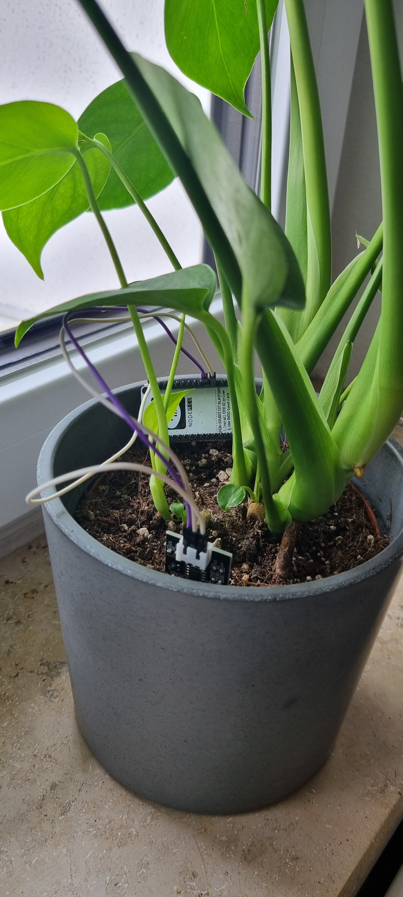

# My Projects in CS Bachelor 📚

This repository bundles several projects where i was involved during my time at the Technical University of Applied Sciences in Augsburg. 
The showcasted projects vary from typical software development to embedded development and machine learning projects.

## Overview
The following briefly introduces each project in this repository with the according semester.

## 2. Semester
The first major project in my bachelor program was the development of a game in Java language, which was created in a team of three students.
The game was developed during the semester lecture time with several extensions added in each week of the semester.

## 3. Semester
In my third and fourth semester i took responsibility as the Manager of Mapping and Path Planning in the Formula Student Team of the university.
The major focus of my work were the management of the sub-team in the driverless group and the development of a Machine Learning algorithm that aims to improve the path planning algorithm.
After implementing the updated path planning algorithm, i wrote a short report about my work, which is located in /fs_path_planning.

## 4. Semester
As part of the bachelor programm in computer science, each student needs to complete two project works. 
Me and my friends decided to conduct a research on the correctness and quality of AI-generated SourceCode in Växjö, Sweden in September 2023.
In the time of September 2023, AI-tools like ChatGPT and GitHub Copilot that are able to generate Source Code were getting used more and more in the development process of software projects.
The goal of our research was to assess the capabilities of LLMs that are able to generate Code. 
A more detailed describtion and the results of the research are published [here](https://arxiv.org/abs/2408.16601).

## 5. Semester
In the fifth semester i gained my first practical work experience as a Software Engineer at the ASAP Engineering GmbH.
During this time, i learnt a lot about data extraction from different (automotive) software tools using Python and worked on improving the automation process in the team.

## 6. Semester
In the last semester before my bachelor thesis i developed a Chatbot that answers questions about the university.
The chatbot is built leveraging small language models and a robust RAG System using Langchain.

  

A very detailed project explanation can be found in /chatbot.

Apart from the chatbot project, i created some small projects during a practical course at the university.
One of the projects is included here and shows the aridity of plants using a microcontroller and automated push notifications on smartphones.
More information about the project is located in /smart_plants.

## 7. Semester
I conducted my bachelor thesis at the BMW Group in Munich and implemented a chatbot that answers questions about internal project data in the department.
The chatbot was built upton a hybrid RAG architecture using VectorRAG and GraphRAG. 
The underlying data was organized in a knowledge graph with over 80,000 retrievable entities.
Moreover, the chatbot was extensively evaluated using common RAG metrics. 
Lastly, the business use case was confirmed by interviewing six project managers in the department and the successful integration of the chatbot in the daily workflow.
