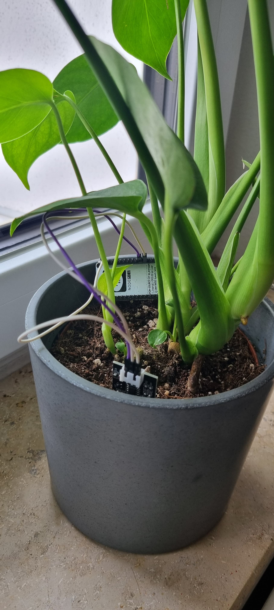

# SmartPlants 🪴
With this project you can measure the aridity of your plants at home. Morover, a microcontroller sends measurements directly to the InfluxDB and visualizes the data using Grafana. 

## Prerequisites
- Microcontroller (e.g. ESP 8266)
- Humidity sensor (e.g. Capacitive soil moisture sensor v1.2)
- Docker & Docker Compose
- Arduino Software
- Access to a small server (e.g. Raspberry PI or NVIDIA Jetson Nano)

## Setup & Installation
First connect the humidity sensor to your microcontroller using the analog `A0` pin on the board.
After finishing the hardware setup you can now configure the InfluxDB and Grafana using the `.env` file in this repository.
Additionally you have to setup your Wifi connection and ip address in the `SmartPlants.ino` file. Make sure that the configurations of your InfluxDB match both in the SmartPlants.ino and .env file. 
Run docker with:
```docker
docker compose up
```

With the Arduino Software or the common extension in VS Code you can flash the `SmartPlants.ino` file to your microcontroller.
After flashing the software you should see the value of the humitity sensor on the serial monitor. 

## Finished 🥳
Now you can setup dashboards and panels to visualize your data in Grafana. You can access InfluxDB and Grafana with your ip address and port `8086` for InfluxDB and `3000` for Grafana. The ports can be changed afterwards in the configuration file if needed.

My hardware setup looks like this:



## Credits
This project is based on the [docker stack](https://github.com/huntabyte/tig-stack) from @huntabyte and has the MIT license.


